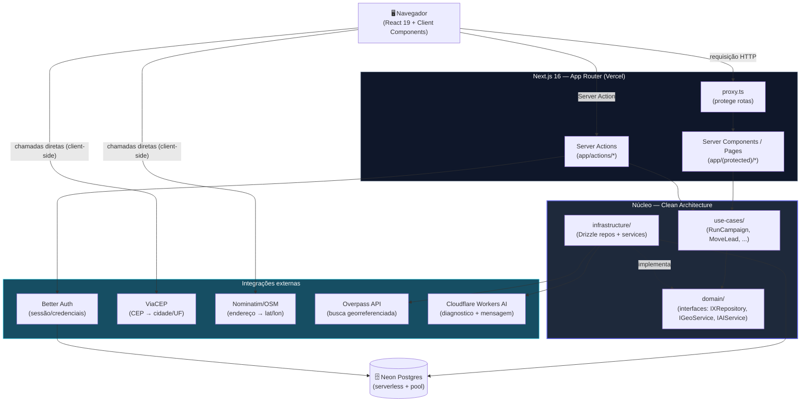

# Visão Geral — O Stack Completo do ProspFlow

> Parte de `diagrams/`. Ver `0_Indice.md` para o mapa completo. Use este arquivo como **slide de abertura** de qualquer aula — ele amarra todos os outros diagramas da pasta.

---

## O que este diagrama explica

Um único diagrama grande, ligando tudo que os outros arquivos explicam em detalhe: o navegador, o Next.js, as camadas internas (Clean Architecture), o banco (Neon) e as integrações externas (ViaCEP, Nominatim, Overpass, Cloudflare AI). É o "mapa-múndi" da aula — depois de mostrar este, você aponta para cada pedaço e abre o diagrama específico dele.

---

## Diagrama

---

## Como ler este diagrama

- **Duas famílias de chamada externa:** ViaCEP e Nominatim são chamadas **direto do navegador** (client-side, no `onBlur` do formulário) — não passam pelo backend. Overpass e Cloudflare AI são chamadas **do lado do servidor**, dentro de `infrastructure/services/`, atrás de uma interface (`IGeoService`, `IAIService`).
- **Better Auth fica "ao lado" das Server Actions, não dentro do Core** — ele não é modelado como um repositório de domínio; é tratado como infraestrutura de autenticação que a camada `app/` consome diretamente (via `auth.api.*` ou `authClient`), mais próximo de uma dependência de framework do que de uma regra de negócio.
- **Todo caminho até o banco passa pelo Core** — não existe atalho de `app/` direto para `db`. Esse é o contrato mais importante do projeto, detalhado em `1_Arquitetura-Clean-Architecture.md`.
- **Para a live:** comece por este diagrama, depois desça para o específico do assunto do dia — `2_Banco-de-Dados-ERD.md` se for aula de schema, `5_Fluxo-Prospeccao-Campanha.md` se for aula de campanhas, etc.
