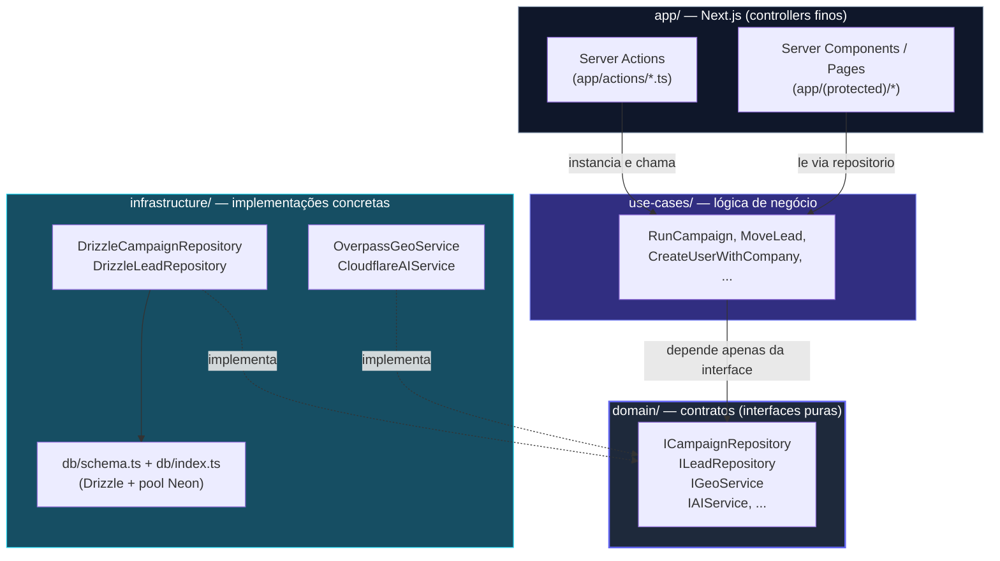
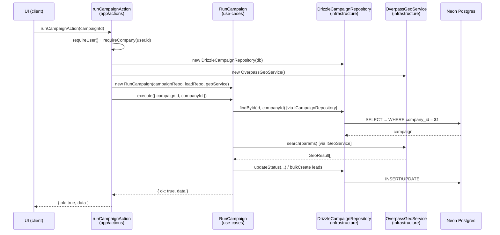

# Arquitetura — Clean Architecture Pragmático

> Parte de `diagrams/`. Ver `0_Indice.md` para o mapa completo. Fonte: `CLAUDE.md` (seção "Arquitetura — regras inegociáveis") e `docs/SPEC.md`.

---

## O que este diagrama explica

O ProspFlow segue Clean Architecture pragmático: não é o "full enterprise" com entities isoladas, mas o suficiente para que trocar o banco ou o provider de IA não toque em lógica de negócio. A regra é simples de falar em voz alta na live: **as setas de dependência sempre apontam para dentro**. `app` depende de `use-cases`, que depende de `domain`. `infrastructure` implementa `domain`. Nunca o inverso.

---

## Diagrama 1 — As camadas e a regra de dependência

---

## Diagrama 2 — Injeção de dependência na prática

Este é o exemplo do `CLAUDE.md`: a action é o **único lugar** onde a implementação concreta é escolhida. O use case nunca sabe que existe Drizzle ou Overpass.

---

## Como ler este diagrama

- **A seta tracejada (`-.->`) em "implementa"** é a inversão de dependência (DIP): `DrizzleCampaignRepository` e `OverpassGeoService` apontam *para* a interface, não o contrário — o use case (`RunCampaign`) só enxerga `ICampaignRepository`/`IGeoService`.
- **`app/` nunca fala com `db` diretamente.** Se você ver `db.query...` dentro de um arquivo em `app/actions/`, é violação de arquitetura — o `CLAUDE.md` lista isso explicitamente como "nunca deve acontecer".
- **A troca de provider é local.** Trocar Overpass por Google Places, por exemplo, significa criar `GooglePlacesGeoService implements IGeoService` em `infrastructure/services/` e mudar uma linha na action — nada em `use-cases/` muda. Isso é o OCP (Open/Closed) do SPEC.
- **`companyId` sempre explícito** — repare que `execute({ campaignId, companyId })` passa o tenant como parâmetro, nunca como contexto global. Ver `3_Multi-Tenant-Isolamento.md` para o fluxo completo disso.
