# ERD — Banco de Dados Completo

> Parte de `diagrams/`. Ver `0_Indice.md` para o mapa completo. Fonte de verdade: `docs/SPEC.md` (schema Drizzle).

---

## O que este diagrama explica

O ProspFlow é multi-tenant: **toda** tabela de negócio pendura em `companies` via `company_id`. Este ERD mostra todas as tabelas do banco, unificando as três fases já implementadas (Aula 1 — Auth/Tenant, Aula 2 — Prospecção, Aula 3 — Funil). Cada tabela está anotada com a fase (`aula-N`) em que foi introduzida, para você conseguir mostrar "isso aqui é o que vamos construir hoje" durante a live.

---

## Diagrama

```mermaid
erDiagram
    USERS ||--o{ SESSIONS : "possui"
    USERS ||--o{ ACCOUNTS : "possui"
    USERS ||--o{ COMPANIES : "e dono de (owner_id)"
    USERS ||--o{ COMPANY_MEMBERS : "e membro de"
    COMPANIES ||--o{ COMPANY_MEMBERS : "tem"
    COMPANIES ||--o{ PROSPECTING_NICHES : "tem"
    COMPANIES ||--o{ PROSPECTING_CAMPAIGNS : "tem"
    COMPANIES ||--o{ PROSPECTING_LEADS : "tem"
    COMPANIES ||--o{ FUNNEL_STAGES : "tem"
    COMPANIES ||--o{ CRM_LEADS : "tem"
    COMPANIES ||--o{ LEAD_ACTIVITIES : "tem"
    PROSPECTING_NICHES ||--o{ PROSPECTING_CAMPAIGNS : "define"
    PROSPECTING_NICHES ||--o{ PROSPECTING_LEADS : "classifica"
    PROSPECTING_CAMPAIGNS ||--o{ PROSPECTING_LEADS : "gera"
    PROSPECTING_LEADS |o--o| CRM_LEADS : "pode virar (1:1 nullable)"
    FUNNEL_STAGES ||--o{ CRM_LEADS : "contem"
    CRM_LEADS ||--o{ LEAD_ACTIVITIES : "historico de"
    FUNNEL_STAGES ||--o{ LEAD_ACTIVITIES : "from_stage / to_stage"
    USERS ||--o{ LEAD_ACTIVITIES : "criado_por"

    USERS {
        text id PK
        text name
        text email UK
        boolean email_verified
        text image
    }

    SESSIONS {
        text id PK
        text token UK
        timestamp expires_at
        text user_id FK
    }

    ACCOUNTS {
        text id PK
        text provider_id
        text user_id FK
        text password
    }

    COMPANIES {
        uuid id PK
        text name
        text slug UK
        text owner_id FK "aula-1"
    }

    COMPANY_MEMBERS {
        uuid id PK
        uuid company_id FK "aula-1"
        text user_id FK
        enum role "owner | member"
    }

    PROSPECTING_NICHES {
        uuid id PK
        uuid company_id FK "aula-2"
        text name
        text_array keywords
        text_array target_services
        text_array common_pains
        text base_message_template
        boolean is_active
    }

    PROSPECTING_CAMPAIGNS {
        uuid id PK
        uuid company_id FK "aula-2"
        uuid niche_id FK
        text city
        varchar2 state
        float latitude
        float longitude
        int radius_km
        int max_results
        enum status "draft running completed failed"
        int total_found
    }

    PROSPECTING_LEADS {
        uuid id PK
        uuid company_id FK "aula-2"
        uuid campaign_id FK
        uuid niche_id FK
        text name
        text phone
        text website_url
        int score "20 a 100"
        enum status "new..do_not_contact"
        enum whatsapp_status
        boolean has_website
        boolean has_instagram
        boolean has_whatsapp
        real rating
        int review_count
        text ai_overview
        text suggested_offer
    }

    FUNNEL_STAGES {
        uuid id PK
        uuid company_id FK "aula-3"
        text name
        int position
        varchar7 color_hex
        enum kind "normal won lost triage"
    }

    CRM_LEADS {
        uuid id PK
        uuid company_id FK "aula-3"
        uuid prospecting_lead_id FK "nullable"
        uuid stage_id FK
        text name
        enum origin "manual prospecting"
        numeric value
    }

    LEAD_ACTIVITIES {
        uuid id PK
        uuid company_id FK "aula-3"
        uuid lead_id FK
        uuid from_stage_id FK "nullable"
        uuid to_stage_id FK "nullable"
        text description
        text created_by FK
    }
```

---

## Como ler este diagrama

- **Toda seta sai de `COMPANIES`** — reforça a regra de tenant safety do `CLAUDE.md`: nenhuma tabela de negócio existe sem `company_id`. Se você for adicionar uma tabela nova na live e ela não pendurar em `companies`, é sinal de que algo está errado no design.
- **`PROSPECTING_LEADS → CRM_LEADS` é 1:1 nullable** — um lead de prospecção pode (ou não) virar um lead do funil comercial. É o gancho da Fase 3 (`ConvertProspectingLead`) com a Fase 2.
- **`LEAD_ACTIVITIES` tem duas FKs para `FUNNEL_STAGES`** (`from_stage_id`, `to_stage_id`) — é o histórico de "de onde para onde" o lead se moveu no Kanban, ambas nullable porque a primeira atividade de um lead não tem "de onde".
- **`USERS.id` é `text`** (Better Auth gera IDs como string), enquanto praticamente todo o resto do schema usa `uuid`. Isso é citado como armadilha no `CLAUDE.md` — nunca referenciar `owner_id`/`created_by` como `uuid`.
- **Enums** (`campaign_status`, `lead_status`, `whatsapp_status`, `company_role`, `stage_kind`, `crm_lead_origin`) são `pgEnum` do Postgres — aparecem no diagrama como comentário no tipo do campo porque Mermaid ERD não modela enums nativamente.
