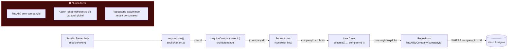

# Multi-Tenant — Isolamento por `companyId`

> Parte de `diagrams/`. Ver `0_Indice.md` para o mapa completo. Fonte: `CLAUDE.md` (seção "Tenant safety").

---

## O que este diagrama explica

ProspFlow é um SaaS onde várias agências (empresas) compartilham o mesmo banco. A regra de ouro é: **toda query filtra por `company_id`, sem exceção.** Este diagrama mostra como o `companyId` nasce na sessão do usuário e é carregado explicitamente por todas as camadas — nunca inferido implicitamente dentro de um repositório ou use case.

---

## Diagrama



---

## Como ler este diagrama

- **`requireCompany(user.id)` é o único lugar que resolve "qual empresa é essa".** A partir daí, `companyId` vira um valor comum passado por parâmetro — não existe "contexto global de tenant" em nenhuma camada.
- **Toda assinatura de repositório recebe `companyId`.** Compare a assinatura correta com a errada do `CLAUDE.md`:
  ```typescript
  // CORRETO
  findAllByCompany(companyId: string): Promise<Niche[]>

  // ERRADO — vaza dados entre tenants
  findAll(): Promise<Niche[]>
  ```
- **Por que isso importa na prática:** se um repositório algum dia esquecer o `WHERE company_id = $1`, a query retorna leads/campanhas de *todas* as agências — um vazamento de dados entre clientes do SaaS. É o tipo de bug que não aparece em teste manual com um usuário só, por isso a regra é "sem exceção" e não "com cuidado".
- **Onde isso é reforçado no código:** toda action começa com `requireUser()` → `requireCompany(user.id)` (convenção do `CLAUDE.md`), e todo use case/repositório novo deve nascer com `companyId` no primeiro parâmetro.
