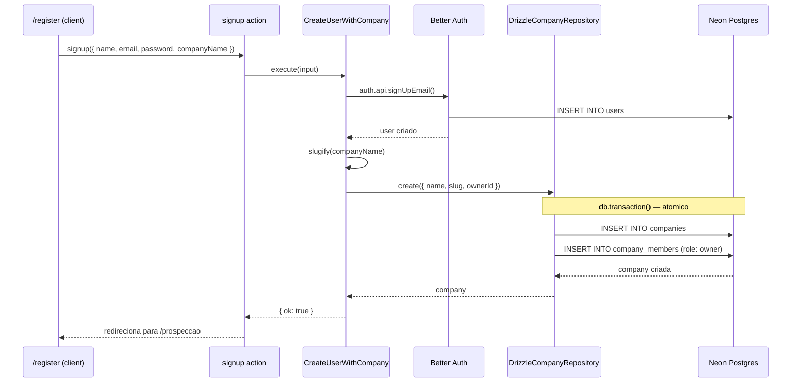
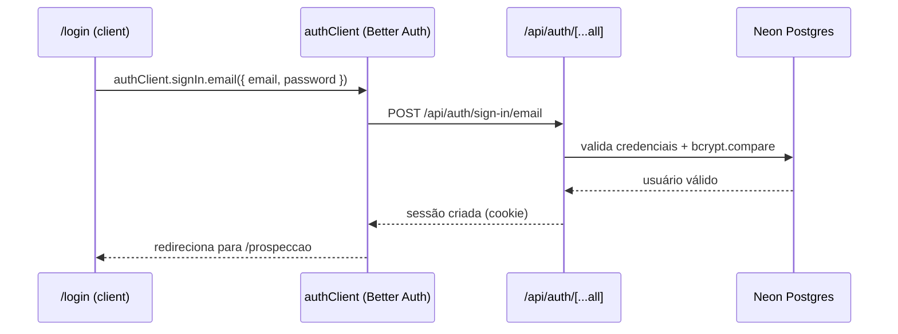
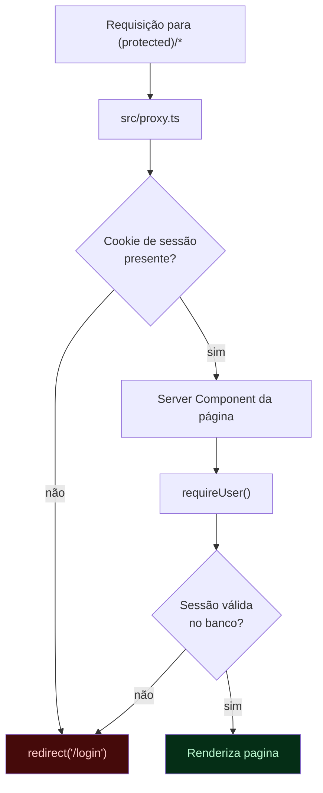

# Fluxo — Autenticação (Signup, Login, Proteção de Rotas)

> Parte de `diagrams/`. Ver `0_Indice.md` para o mapa completo. Fonte: `phases/aula-1/`, `docs/setup-next16-better-auth-neon.md`.

---

## O que este diagrama explica

A Aula 1 monta autenticação com Better Auth + criação automática de empresa no cadastro (transação `user + company + company_member`), e protege as rotas `(protected)` com um proxy que valida a sessão. Este arquivo tem três diagramas: cadastro, login, e proteção de rota.

---

## Diagrama 1 — Signup (`CreateUserWithCompany`)

---

## Diagrama 2 — Login

---

## Diagrama 3 — Proteção de rotas (proxy)

---

## Como ler este diagrama

- **A transação no signup é o ponto mais importante da Aula 1.** Se `INSERT INTO companies` funcionar mas `INSERT INTO company_members` falhar, sem transação você teria uma empresa órfã, sem dono. `db.transaction()` garante tudo-ou-nada.
- **`usersTable.id` é `text`, não `uuid`** — Better Auth já gera o ID do jeito dele. `companiesTable.ownerId` referencia esse campo como `text`, e é por isso que o `CLAUDE.md` avisa para nunca trocar esse tipo.
- **O proxy hoje (Aula 1–3) só checa se o cookie existe** — a validação completa da sessão (bate no banco) acontece depois, dentro de `requireUser()`. O Diagrama 3 já mostra o comportamento-alvo da Aula 4 (`3_Proxy-Validacao-de-Sessao.md`), que fecha essa lacuna validando a sessão no próprio proxy.
- **`role: "owner"`** é o único valor usado hoje — o schema já suporta `member` para um fluxo futuro de convite de equipe, que está fora do escopo atual (ver `SPEC.md`, Fase 4 "Fora de escopo").
