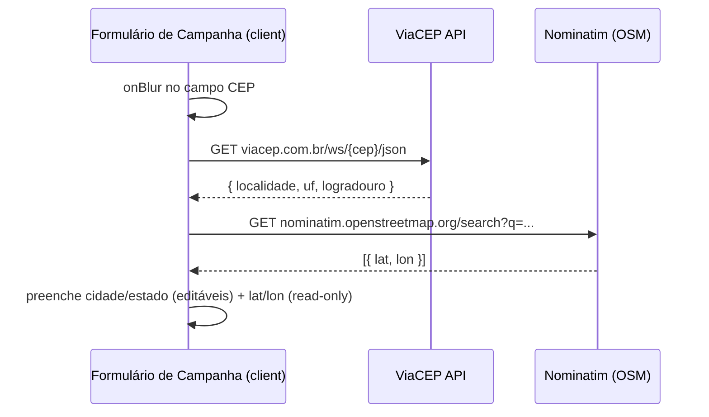
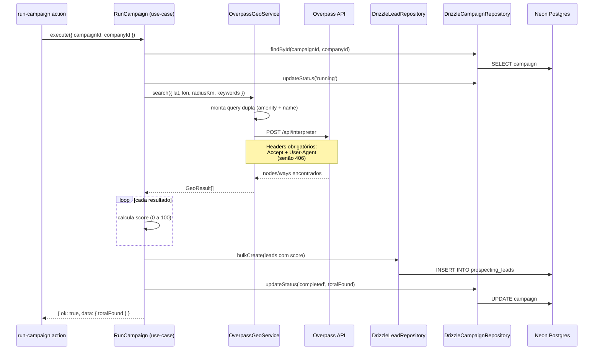
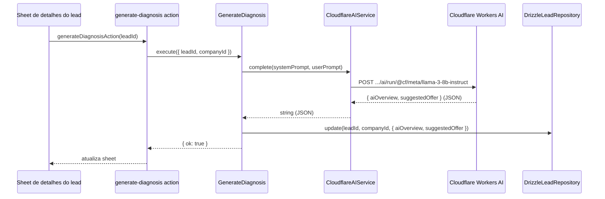

# Fluxo — Prospecção (Criar Campanha e Executar Busca)

> Parte de `diagrams/`. Ver `0_Indice.md` para o mapa completo. Fonte: `docs/SPEC.md` (Integrações externas), `phases/aula-2/`.

---

## O que este diagrama explica

Este é o fluxo mais rico do sistema: o usuário digita só um **CEP**, o formulário resolve cidade/estado/coordenadas automaticamente (client-side), e ao rodar a campanha o use case `RunCampaign` orquestra a busca geo-referenciada, o algoritmo de score e a qualificação por IA — sem que nenhuma dessas integrações apareça em `use-cases/` como implementação concreta (tudo via `IGeoService`/`IAIService`).

---

## Diagrama 1 — Preenchimento do formulário (client-side)

---

## Diagrama 2 — Execução da campanha (`RunCampaign`)

---

## Diagrama 3 — Qualificação de um lead com IA (sob demanda)

---

## Como ler este diagrama

- **A "query dupla" do Overpass existe por causa do idioma.** As keywords do nicho são em português ("restaurante"), mas o OpenStreetMap usa `amenity` em inglês ("restaurant"). A busca por `amenity` pega a maioria dos casos; a busca por `name~"restaurante",i` é o fallback para estabelecimentos sem essa tag.
- **O score é calculado no use case, não na infraestrutura** — `OverpassGeoService` só devolve dados brutos (`GeoResult[]`). A regra de pontuação (website +20, telefone +15, rating, etc.) é lógica de negócio, então mora em `RunCampaign`.
- **O header `Accept` no fetch server-side é uma armadilha real** — o Node.js não envia esse header por padrão como o browser envia, e o proxy da Overpass responde `406 Not Acceptable` sem ele.
- **`GenerateDiagnosis`/`GenerateMessage` são chamadas sob demanda**, uma por lead, diferente do `RunCampaign` que processa em lote — por isso são actions/use cases separados, cada um só qualifica um lead.
