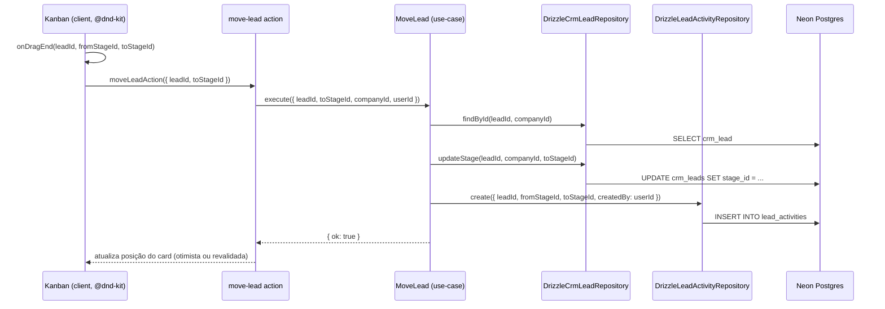
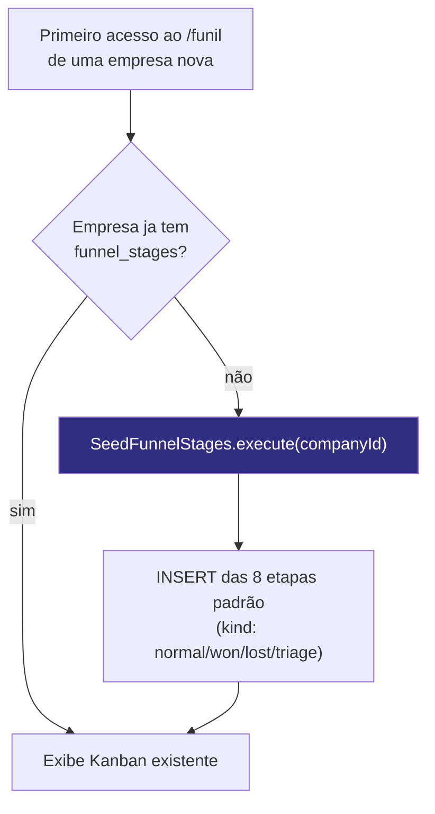

# Fluxo — Funil Comercial (Kanban)

> Parte de `diagrams/`. Ver `0_Indice.md` para o mapa completo. Fonte: `phases/aula-3/`, `docs/DOC_Funil.md`.

---

## O que este diagrama explica

A Aula 3 constrói um Kanban com drag & drop (`@dnd-kit`) sobre o pipeline comercial. Duas coisas acontecem quando um lead é arrastado: o `stage_id` muda, e uma `LeadActivity` é registrada como histórico. Este arquivo também mostra o bootstrap automático das etapas padrão para uma empresa nova.

---

## Diagrama 1 — Arrastar um card entre colunas (`MoveLead`)

---

## Diagrama 2 — Bootstrap das etapas padrão (`SeedFunnelStages`)

---

## Como ler este diagrama

- **Duas escritas em uma ação do usuário:** mover um card não é só um `UPDATE` — é `UPDATE` (posição atual) + `INSERT` (histórico). Isso é o que permite a aba "Histórico" no `LeadDrawer` mostrar a jornada completa do lead pelo funil.
- **`fromStageId` pode ser nulo** — a primeira atividade de um lead criado direto em uma coluna (não arrastado) não tem "de onde veio".
- **O bootstrap hoje é lazy** (roda dentro de `getFunilBootstrapAction`, disparado quando a página `/funil` é acessada) — a Aula 4 (`1_Seed-Automatico-no-Cadastro.md`) move esse gatilho para o momento do cadastro/primeiro login, para que o Kanban já apareça populado sem depender do usuário abrir a página do funil primeiro.
- **`stageKind`** (`normal`, `won`, `lost`, `triage`) existe para a UI saber quais colunas são "estados finais" (won/lost) versus estágios normais do pipeline — relevante para métricas futuras de conversão.
