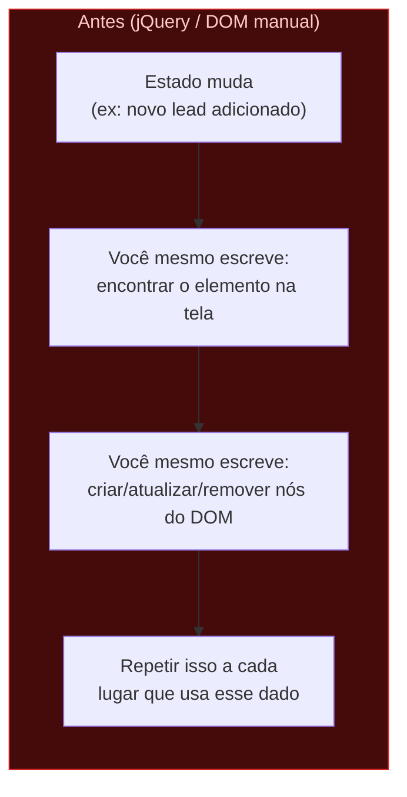
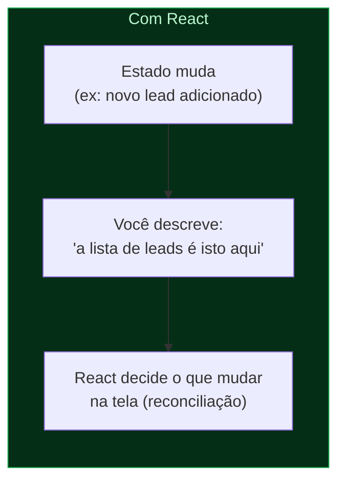
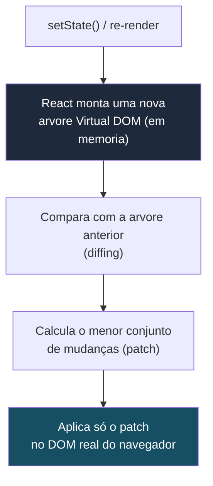
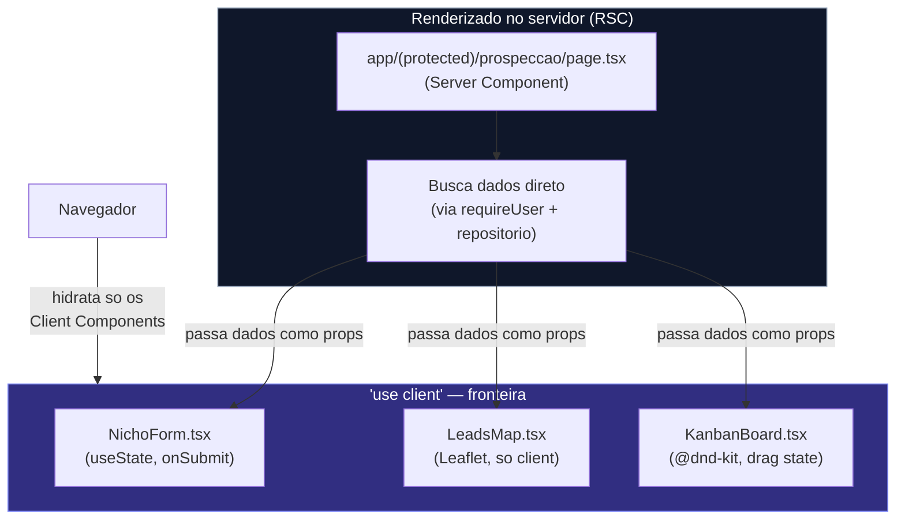

# Conceitos — Por que React? Virtual DOM, Server vs Client Components

> Parte de `diagrams/`. Ver `0_Indice.md` para o mapa completo. Diagrama conceitual — não específico do ProspFlow, mas usa exemplos do projeto para ancorar a explicação.

---

## O que este diagrama explica

Antes de mostrar código React na live, vale explicar **o problema que ele resolve**. Este arquivo tem três diagramas: (1) o problema da manipulação imperativa do DOM que motivou o React, (2) como o Virtual DOM resolve isso, e (3) a divisão Server Components vs Client Components — que é onde React 19 + Next.js 16 mudam o jogo em relação ao React "clássico" de SPA.

---

## Diagrama 1 — O problema: manipulação imperativa do DOM (era jQuery)

---

## Diagrama 2 — Virtual DOM e reconciliação

---

## Diagrama 3 — Server Components vs Client Components (React 19 + Next.js 16)

---

## Como ler este diagrama

- **O React nasceu para eliminar a manipulação manual do DOM** — no Facebook, apps grandes com muito estado compartilhado (ex: contador de notificações mudando em 5 lugares da tela ao mesmo tempo) viravam um pesadelo de sincronização manual. A ideia central: você descreve "como a UI deve ser para este estado", e a biblioteca cuida de aplicar as mudanças.
- **Virtual DOM não é mágica, é uma otimização de diffing** — manipular o DOM real é caro; comparar duas árvores em memória (JS puro) é barato. React troca "várias mudanças diretas no DOM" por "uma comparação em memória + um patch mínimo".
- **Server Components são a mudança mais recente e a mais relevante para o ProspFlow:** por padrão, todo componente em `app/` roda **no servidor**, nunca manda JavaScript para o navegador, e pode ler direto do banco (via `requireUser()`/repositório). Só vira Client Component (`"use client"`) quando precisa de interatividade real — `useState`, formulários, mapas Leaflet, drag & drop.
- **Isso explica a tabela do `CLAUDE.md`:** `"use client"` só em formulários, modais, mapas e DnD. É exatamente a linha entre "isso precisa rodar no navegador" e "isso só precisa aparecer na tela".
- **Hidratação** é o processo do navegador "religar" o JavaScript nos Client Components depois do HTML inicial chegar do servidor — por isso Leaflet precisa de `dynamic(() => import(...), { ssr: false })`: ele manipula o DOM diretamente e quebra se tentar rodar durante a renderização no servidor.
