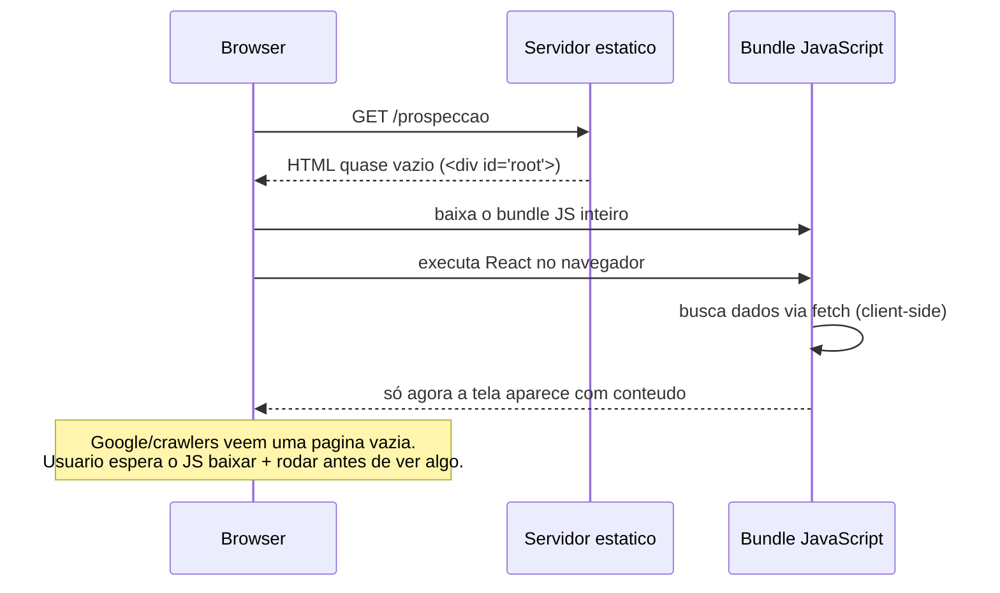
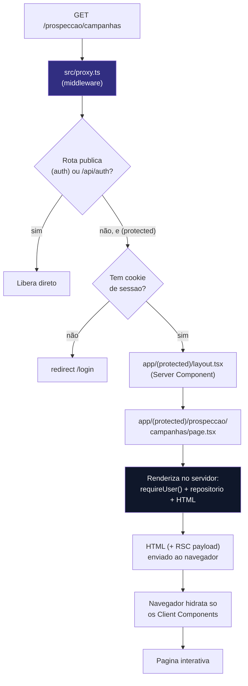
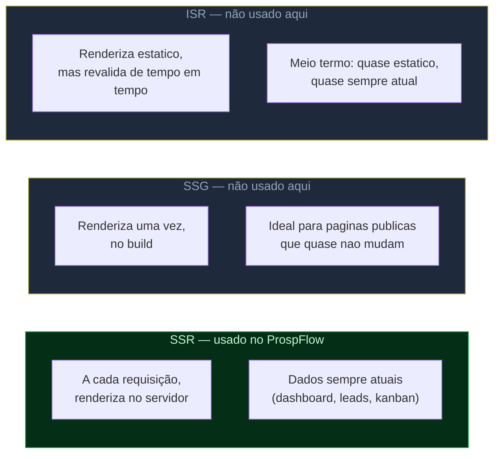

# Conceitos — Por que Next.js? App Router, SSR/SSG/ISR

> Parte de `diagrams/`. Ver `0_Indice.md` para o mapa completo. Diagrama conceitual, ancorado nos arquivos reais do ProspFlow (`src/proxy.ts`, `app/(protected)/layout.tsx`).

---

## O que este diagrama explica

React puro só resolve "como renderizar a UI" — ele não decide onde essa renderização acontece, não tem roteamento embutido, e por padrão só roda no navegador (SPA), o que é ruim para SEO e para o primeiro carregamento. O Next.js resolve isso: é um framework em cima do React que adiciona roteamento por pastas, renderização no servidor, e a escolha de *quando* renderizar cada página.

---

## Diagrama 1 — O problema do SPA puro (Create React App / Vite sem framework)

---

## Diagrama 2 — Ciclo de vida de uma requisição no App Router (ProspFlow)

---

## Diagrama 3 — Estratégias de renderização (onde o ProspFlow se encaixa)

---

## Como ler este diagrama

- **Next.js resolve dois problemas do React puro ao mesmo tempo:** roteamento (pastas em `app/` viram rotas automaticamente — sem instalar `react-router`) e onde renderizar (servidor por padrão, não só no navegador).
- **`src/proxy.ts` roda antes de qualquer coisa** — é a primeira parada de toda requisição, e é onde a proteção de rotas acontece antes mesmo do React entrar em cena.
- **Todo Server Component do ProspFlow usa SSR (renderização a cada requisição), não SSG.** Faz sentido: um dashboard de leads e um Kanban comercial mudam a cada minuto — teria pouco valor gerar essa página uma vez no build e servir sempre a mesma versão.
- **"RSC payload"** é a serialização especial que o Next.js manda junto com o HTML — permite ao navegador saber quais partes da árvore são Server Components (já prontos, sem JS) e quais são Client Components (precisam hidratar). É a peça técnica que faz `7_Conceitos-React.md` (Server vs Client Components) funcionar de verdade.
- **Por que isso importa para SEO/performance:** comparado ao Diagrama 1 (SPA puro), o usuário já vê HTML com conteúdo real na primeira resposta — não precisa esperar o bundle JS inteiro baixar e rodar para ver alguma coisa na tela.
