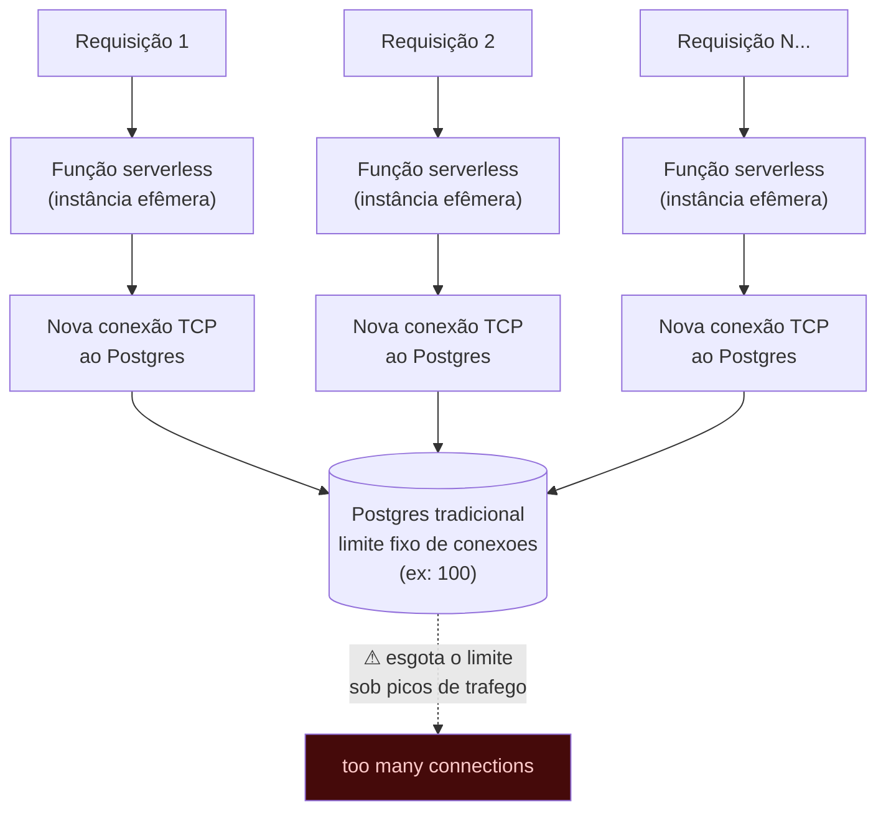
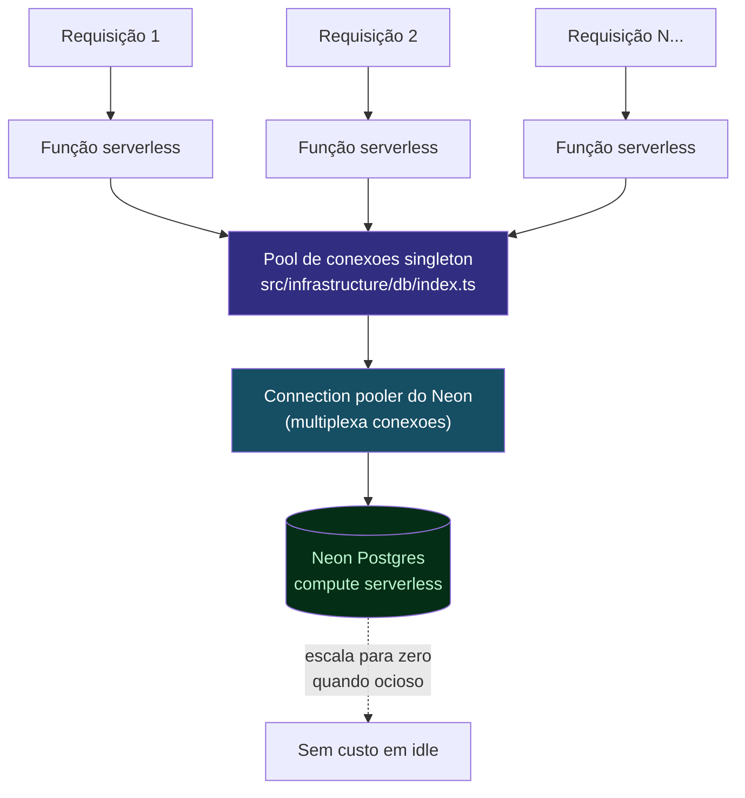

# Conceitos — Por que Neon? Postgres Serverless e Connection Pooling

> Parte de `diagrams/`. Ver `0_Indice.md` para o mapa completo. Fonte: `docs/setup-next16-better-auth-neon.md` § 4.

---

## O que este diagrama explica

Postgres tradicional foi desenhado para um servidor de aplicação de longa duração, com um número previsível de conexões abertas. Ambientes serverless/edge (como o Vercel, onde o ProspFlow roda) são o oposto disso: cada requisição pode rodar em uma função efêmera, e centenas delas podem "nascer" ao mesmo tempo. Este diagrama mostra o problema e como o Neon resolve.

---

## Diagrama 1 — O problema: serverless + Postgres tradicional

---

## Diagrama 2 — A solução: Neon (serverless Postgres + pooling)

---

## Como ler este diagrama

- **O pool é criado uma única vez, como singleton** (`src/infrastructure/db/index.ts`) — não uma conexão nova por requisição. É esse arquivo que os repositórios recebem por injeção no construtor, conforme a convenção do `CLAUDE.md` ("repositórios recebem `db` no construtor, nunca importam globalmente").
- **`sslmode=require` na `DATABASE_URL`** não é opcional — o Neon exige TLS na conexão, diferente de um Postgres local em Docker.
- **"Escala para zero"** é a característica que justifica o nome "serverless Postgres": em desenvolvimento (ou uma agência pequena com pouco tráfego à noite), o compute do Neon hiberna e você não paga por capacidade ociosa — ele "acorda" na próxima query, com uma pequena latência de cold start.
- **Por que não um Postgres tradicional numa VM:** funcionaria, mas você pagaria por uma instância ligada 24/7 e teria que gerenciar o limite de conexões manualmente (via PgBouncer próprio) — o Neon já entrega isso pronto, integrado ao driver.
- **Branching (mencionado no setup, não usado ativamente no projeto ainda):** o Neon permite criar um "branch" do banco (cópia copy-on-write) para testar uma migration arriscada sem tocar em produção — vale citar na live como diferencial, mesmo sem estar no fluxo atual do ProspFlow.
